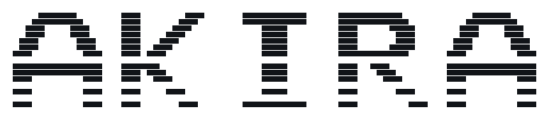
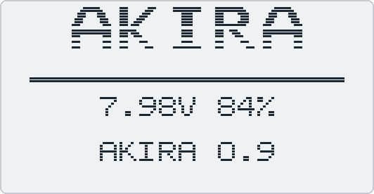
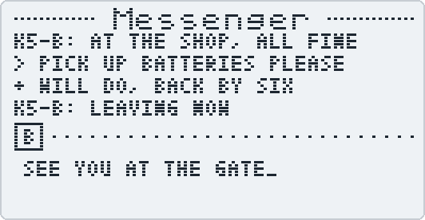
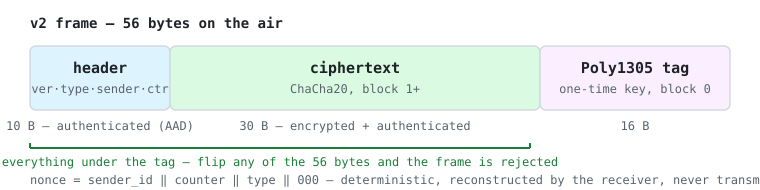

<div align="center">

<picture>
  <source media="(prefers-color-scheme: dark)" srcset="images/akira-logo-dark.svg">
  
</picture>

**Custom firmware for the Quansheng UV-K5.**

Authenticated, encrypted radio-to-radio messaging that works with no network, no infrastructure
and no third party — plus the monitoring features needed to know what is on the air around you.

[](https://github.com/assyr1an/Quansheng_UV-K5_Firmware_AKIRA/actions/workflows/main.yml)
[](https://github.com/assyr1an/Quansheng_UV-K5_Firmware_AKIRA/releases/tag/0.9)
[](LICENSE)
[](docs/PROTOCOL.md)

[**Building**](docs/BUILDING.md) · [**Protocol**](docs/PROTOCOL.md) · [**Security model**](docs/SECURITY.md) · [**Host tools**](tools/) · [**Changelog**](CHANGELOG.md)

</div>

---

> [!IMPORTANT]
> **Status: 0.9 — feature complete.** Runs on real hardware; voice operation is verified against
> a second transceiver; the firmware's crypto reproduces the reference vectors byte-for-byte.
> **The encrypted messenger awaits its pair test**: every protocol claim below is implemented and
> host-verified, but no v2 message has yet crossed between two AKIRA radios — that takes two
> UV-K5s holding the same key, and the [27-test bench list](docs/PROTOCOL.md#bench-validation--the-27-tests-between-09-and-100)
> is what stands between 0.9 and `1.0.0`.

<div align="center">

<picture>
  <source media="(prefers-color-scheme: dark)" srcset="images/screen-boot-dark.svg">
  
</picture>&nbsp;&nbsp;
<picture>
  <source media="(prefers-color-scheme: dark)" srcset="images/screen-messenger-dark.svg">
  
</picture>

<sub>Renders of the actual 128×64 UI, generated from the firmware's own font tables and draw
code. `+` = delivery-confirmed by an authenticated ACK. The over-the-air link itself is not
yet pair-validated.</sub>

</div>

## What AKIRA adds

| | Capability | Evidence / status |
|---|---|---|
| **Messenger v2** | RFC 8439 ChaCha20-Poly1305 on every frame, deterministic nonces, in-session replay suppression, authenticated ACKs, byte-identical auto-retry | Codec verified byte-for-byte against host vectors, in CI · **OTA pair test pending** |
| **Security** | Two-gesture panic wipe (messages first; key in EEPROM+RAM on confirmed second press, incl. inside spectrum) · on-radio key fingerprint (`KeyID`) · read-back-verified EEPROM writes | Built and flashed · wipe gestures need bench eyes |
| **Monitoring** | **18 MHz – 1300 MHz receive** — the BK4819's full range, less its own 630–840 MHz gap · interval-driven priority scanning · scan-hit auto-store · bounded activity log · 16-entry message ring with paging | Wide RX built and flashed · scan cadence unbenched |
| **Host tools** | EEPROM backup, flashing, key provisioning, channel programming from JSON, TX-band policy, self-test, calibration guard | Used for every flash of this firmware to date |

<div align="center">
<picture>
  <source media="(prefers-color-scheme: dark)" srcset="images/frame-dark.svg">
  
</picture>
</div>

<details>
<summary><b>Protocol design details</b></summary>

* **RFC 8439 ChaCha20-Poly1305** on every frame, with the header as additional authenticated
  data, so the version, type, sender and counter are authenticated alongside the payload.
* **No key derivation at all.** A 256-bit master key is provisioned over USB from the host's
  CSPRNG. v1 expanded a 16-byte secret with FNV-1, which collapsed the key to at most 2⁶⁴
  values regardless of input.
* **Deterministic nonces** — `sender_id ‖ counter ‖ type`. Nonces need uniqueness, not
  unpredictability, which removes any dependence on the radio's very weak hardware RNG.
* **In-session replay and duplicate suppression** — a per-sender counter window. A duplicate
  is re-acknowledged but never re-displayed; an older frame is dropped silently. The window is
  RAM-only and resets on reboot ([`docs/SECURITY.md`](docs/SECURITY.md), Limitations).
* **Authenticated ACKs** that name the exact message they acknowledge, so a stale ACK cannot
  confirm a different transaction.
* **Automatic retry** by byte-identical retransmission, consuming no additional nonce.
* **A different FSK sync word from v1**, so the two protocols are invisible to each other at
  the hardware layer.
* **Removed on purpose:** AirCopy (it clones the encryption key over the air, and would clone
  the per-radio sender identity into nonce reuse) and the v1 `EncKey` / `MsgEnc` menus (they
  edited a secret protocol v2 does not read).

Full specification: [`docs/PROTOCOL.md`](docs/PROTOCOL.md). Threat model and limitations —
the honest half: [`docs/SECURITY.md`](docs/SECURITY.md).

</details>

## Hardware

Quansheng UV-K5, UV-K5(8) and UV-K6 — **original (V1) hardware only.** A USB programming cable
is required for flashing and for key provisioning — the K5's is a K-type 2-pin connector, and
an FTDI-based cable is recommended.

> [!WARNING]
> **Not compatible with the newer "UV-K5 V2" or "V3" hardware revisions** sold under the same
> name since 2025. Those are different platforms with their own firmware lines, and no firmware
> in this lineage runs on them. **How to tell:** check the stock firmware version — `2.01.xx`
> (K5/K5(8)) or `3.00.xx` (K6) is supported V1 hardware; `1.xx` ("py030", V2) or `7.xx` (V3)
> is not. When buying a radio for this firmware, confirm the listing is V1.

> [!CAUTION]
> **Back up before you flash.** Factory RF calibration at EEPROM `0x1E00–0x1FFF` is unique to
> your radio and unrecoverable; CHIRP does not capture it. [`docs/BUILDING.md`](docs/BUILDING.md)
> covers this first, and the included [`tools/k5_guard.py`](tools/k5_guard.py) refuses to let a
> session continue if calibration has changed.

## Quick start

**1. Get the firmware** — download `akira-0.9.bin` (and verify against `SHA256SUMS`) from the
[latest release](https://github.com/assyr1an/Quansheng_UV-K5_Firmware_AKIRA/releases/tag/0.9), or build it yourself:

```sh
docker build -t akira .
docker run --rm -v "$PWD/out:/out" akira \
  /bin/bash -c "cd /app && make && cp firmware.bin /out/"
```

`akira-0.9.bin` / `firmware.bin` is for the included flasher below; `akira-0.9.packed.bin` is
for the stock Quansheng flasher.

**2. Back up, flash, verify** — the host tools need Python 3 and one package
(`python -m pip install -r tools/requirements.txt`):

```sh
# Back up the radio's EEPROM — not optional
python tools/k5_eeprom_dump.py --port <PORT> --radio k5-A

# Flash (bootloader: hold PTT, switch on), then verify
python tools/k5_flash.py --port <PORT> --file akira-0.9.bin --yes
python tools/k5_selftest.py --port <PORT> --expect-version-exact "AKIRA 0.9"
python tools/k5_guard.py --port <PORT> --baseline <backup>.raw --allow 0x0E80-0x0E88

# Provision the messenger key (first radio mints it; later radios share it)
python tools/k5_provision.py --port <PORT> --new-key --keyfile v2-key.json
```

<details>
<summary>Finding <code>&lt;PORT&gt;</code> on your OS</summary>

- **Windows** — Device Manager → Ports; typically `COM5`, `COM22`, …
- **Linux** — `ls /dev/ttyUSB*` (FTDI/CH340); add yourself to the `dialout` group or use `sudo`.
- **macOS** — `ls /dev/tty.usbserial-*` or `/dev/tty.wchusbserial*`.

</details>

Full instructions, including the bootloader sequence and the three post-flash checks, are in
[`docs/BUILDING.md`](docs/BUILDING.md).

## Documentation

| | |
|---|---|
| [`docs/BUILDING.md`](docs/BUILDING.md) | Build, flash, provision, verify |
| [`docs/PROTOCOL.md`](docs/PROTOCOL.md) | The messenger v2 wire format and semantics, and the bench list gating 1.0.0 |
| [`docs/SECURITY.md`](docs/SECURITY.md) | Threat model, construction, and the limitations |
| [`tools/`](tools/) | Host tooling — backup, flash, provision, verify, and the host-side crypto tests |
| [`CHANGELOG.md`](CHANGELOG.md) | What changed, and what is still unproven |

## Roadmap to 1.0.0

`1.0.0` is reserved for the day the
[27-test bench list](docs/PROTOCOL.md#bench-validation--the-27-tests-between-09-and-100)
passes on a pair of AKIRA radios: frame survival at every baud rate, wrong-key rejection,
counter persistence across power cycles, replay rejection, retry semantics, ACK-storm absence,
and the panic wipe under fire. Until then the protocol should be considered frozen but
unproven on the air.

## Contributing

Issues and pull requests are welcome — see [`CONTRIBUTING.md`](CONTRIBUTING.md) for the
ground rules (the wire format is frozen until 1.0.0; every PR states its measured flash
delta; crypto changes must pass the vector test). Findings against
[`docs/SECURITY.md`](docs/SECURITY.md) or the protocol spec are especially valuable, and the
single most useful contribution right now is
[bench-test results from your own pair of radios](docs/PROTOCOL.md#bench-validation--the-27-tests-between-09-and-100).
Exploitable vulnerabilities: use private reporting — see the top of
[`docs/SECURITY.md`](docs/SECURITY.md).

## Lineage, credits and licence

AKIRA is a fork of [kamilsss655/uv-k5-firmware-custom](https://github.com/kamilsss655/uv-k5-firmware-custom)
(the "nunu" firmware), itself a fork of
[Egzumer](https://github.com/egzumer/uv-k5-firmware-custom), derived in turn from
[joaquimorg](https://github.com/joaquimorg) and
[DualTachyon](https://github.com/DualTachyon)'s open re-implementation of the stock firmware.
**The vast majority of this radio's behaviour — the RF driver, the UI, the spectrum analyser,
the scanner — is upstream work, and AKIRA would not exist without it.**

Licensed under the Apache License 2.0. Copyright notices in inherited files belong to their
original authors and are unchanged; files original to AKIRA carry their own. Forked at
upstream v.20.5 — the mesh "NUNU Protocol" advertised by upstream landed in v.21.0 and is
**not** present in this tree; AKIRA's messenger is a flat broadcast group. The unmodified
upstream history is preserved on the [`upstream`](../../tree/upstream) branch.

<details>
<summary><b>Full credits</b></summary>

* [kamilsss655](https://github.com/kamilsss655) — the fork AKIRA is built from, including the
  FSK messenger this project's protocol v2 replaces
* [Egzumer](https://github.com/egzumer) — the fork that one came from
* [Joaquimorg](https://github.com/joaquimorg) and
  [DualTachyon](https://github.com/DualTachyon) — the open re-implementation everything rests on
* [OneOfEleven](https://github.com/OneOfEleven), [Mikhail](https://github.com/fagci),
  [Andrej](https://github.com/Tunas1337), [Manuel](https://github.com/manujedi),
  [@Matoz](https://github.com/spm81) and the many others credited upstream

</details>

> [!WARNING]
> Users are responsible for ensuring compliance with all local laws and regulations governing
> the use of this technology. This firmware comes with no warranty of any kind, and carries a
> risk of rendering a radio unusable. Use it at your own risk.
